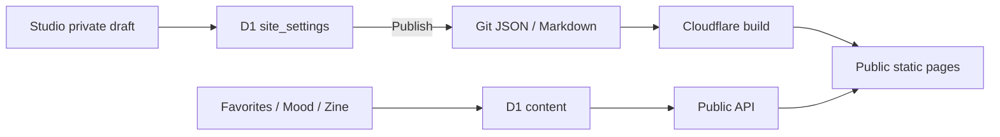

# HELICASE

> 一张由文章、项目、兴趣与真实活动组成的个人线索画布。

[访问网站](https://helicase.xin) · [文章](https://helicase.xin/blog) · [最近动态](https://helicase.xin/now) · [项目](https://helicase.xin/projects)

## 数据架构

每类数据只有一个事实源：

| 数据 | 唯一事实源 | 公开方式 |
|---|---|---|
| Articles / Notes | `src/content/blog/**/*.md` | Git 提交后由 Cloudflare 构建 |
| Profile | `src/data/profile.json` | Studio Publish 或直接修改 Git |
| Projects | `src/data/projects.json` | Studio Publish 或直接修改 Git |
| Links | `src/data/links.json` | Studio Publish 或直接修改 Git |
| Inspirations | `src/data/inspirations.json` | 修改 Git 后构建 |
| GitHub 与手工活动 | `src/data/activity-history.json` | 追加同步后提交并构建 |
| Favorites / Mood / Zine | Cloudflare D1 | Studio 保存后由公开 API 立即读取 |
| Comments / 限流 / 用量 | Cloudflare D1 | Worker API |
| Editor 草稿 | 浏览器 `localStorage` | 不公开、不同步、不备份 |
| 私人日报与选定的 Codex 摘要 | `.helicase/` | 永不进入 Git；明确生成 Notes 草稿后才可能公开 |



`draft saved`、`published to GitHub`、`waiting for deployment`、`live` 是四个不同状态。D1 持久化草稿 revision、hash 和发布 commit；公开 `/build-meta.json` 保存构建 commit 与三个公开 JSON 的内容 hash。Studio 只有在已发布 hash 出现在公开构建中时才显示 Live，因此刷新页面或后续无关提交不会丢失或误判状态。

## GitHub 活动历史

活动同步读取 GitHub Public Events，将原始记录以稳定事件 ID 追加到 `activity-history.json`：

```sh
npm run sync:activity-history
```

`.github/workflows/sync-activity-history.yml` 每天北京时间 22:30 自动执行同一命令，也支持在 GitHub Actions 手动触发。只有历史文件确实变化时才提交到 `main`；该提交随后触发 Cloudflare 构建。

同步规则：

- 使用 `github:<event.id>` 去重；
- 保存精确 `occurredAt`，页面按 Asia/Shanghai 聚合；
- 保留 400 天；
- API 失败发生在写入前，不破坏旧历史；
- 同步锁阻止并发覆盖；
- 临时文件加原子替换，避免半写入；
- 没有变化时不写文件、不制造空提交。

首页与 `/now` 共用 `src/lib/activity-feed.ts`，统一合并活动历史和公开 Markdown 发布事件。

## Projects 状态

Projects 不使用由提交数猜测的完成百分比。`status` 表示项目是否 active / paused / archived，`phase` 表示 exploring / building / validating / maintaining；`current` 和 `next` 保持人工表达。只有存在明确分母时才填写 `milestone.completed / milestone.total`。

项目可通过 `githubRepos` 关联公开 GitHub 仓库。页面从 `activity-history.json` 自动推导最后活动日期和最近 7/30 天动作数；同步脚本不会改写项目定位、阶段、焦点或下一步。

## 写作与发布

创建文章或 Notes：

```sh
npm run new:post -- tech "文章标题"
npm run new:note -- "Notes 标题"
```

新文件默认 `draft: true`。发布前完成摘要和正文、移除或改为 `draft: false`，再运行：

```sh
npm run verify
```

线上 `/editor` 可通过受保护的 GitHub Contents API 写入 Markdown。它的浏览器自动保存只属于 `localStorage`，不能视为已发布。

## 私人日报工作流

日报把自动事实整理和个人表达分开。它不会扫描所有 Codex 对话；只有你明确加入的工作摘要才进入日报。

主动加入一条工作上下文：

```sh
npm run daily:add-context -- "把活动数据迁移到唯一历史源，完成了失败保护"
```

收集当天日报：

```sh
npm run daily:collect
```

结果保存在 `.helicase/daily/YYYY-MM-DD.md`：

1. 脚本写入 GitHub 与手工活动证据；
2. 你补充“我的心得”；
3. Codex 根据整份日报填写“Codex 复盘”；
4. 你决定是否填写“公开候选”；
5. 生成公开 Notes 草稿：

```sh
npm run daily:prepare-note -- YYYY-MM-DD
```

这个命令只生成 `draft: true` 的 Markdown，不会提交、推送或公开。公开仍需要一次明确确认。

## Studio

生产 `/studio` 与 `/editor` 由 Worker Basic Auth 保护。

- Favorites / Mood / Zine：保存到 D1 后立即成为公开 API 数据；
- Profile / Links / Projects：Save Draft 只写私有 D1；Publish 才写 GitHub；
- 初次没有 D1 草稿时，Studio 会加载当前构建中的公开 JSON 作为编辑起点；
- Save Draft 必须携带 `expectedRevision`，两个窗口不会静默覆盖；
- Publish 同时校验 revision、草稿 hash 与 GitHub 文件 SHA；
- D1 保存 `published_hash`、`published_commit_sha` 和 `published_at`，刷新 Studio 后仍可恢复发布状态。

生产 Worker Secrets：

- `STUDIO_USERNAME`
- `STUDIO_PASSWORD`
- `GITHUB_CONTENT_TOKEN`
- `GITHUB_OAUTH_CLIENT_SECRET`
- `SESSION_SECRET`
- `RATE_LIMIT_SALT`
- `TURNSTILE_SECRET_KEY`
- `DEEPSEEK_API_KEY`
- `DEEPSEEK_MODEL`（可选，默认 `deepseek-chat`）

生产 Worker Variables：

- `GITHUB_OWNER`
- `GITHUB_REPO`
- `GITHUB_OAUTH_CLIENT_ID`
- `OC_DAILY_LIMIT`

构建环境 Variables：

- `SITE_URL`
- `PUBLIC_TURNSTILE_SITE_KEY`

本地示例值见 `.dev.vars.example` 与 `.env.example`。`GITHUB_CONTENT_TOKEN` 使用只允许目标仓库 Contents 读写的 fine-grained token；`SESSION_SECRET` 与 `RATE_LIMIT_SALT` 应使用独立随机值。

## 本地开发与验证

要求 Node.js `>=22.12.0`：

```sh
npm install
npm run dev
```

完整静态验证：

```sh
npm run verify
```

它依次验证文章、公开 JSON、Astro 类型、构建、内部链接、隐私标记、活动来源、内容 hash 和首页/Now 一致性。

Worker dry-run：

```sh
npm run check:worker
```

它还会在隔离的临时 D1 与假 GitHub API 上复现：Basic Auth、`0001 → 0003` migration、草稿 CAS、发布冲突、发布状态持久化和新私有草稿。单独运行：

```sh
npm run smoke:worker
```

## 部署

- Astro 输出静态页面；
- Cloudflare Worker 处理受保护 API、D1 与 Static Assets；
- `main` 分支触发生产构建；
- `build-meta.json` 记录构建对应的 Git commit、源码是否干净及公开设置内容 hash；
- 自定义域名为 [helicase.xin](https://helicase.xin)。

手动部署命令：

```sh
npm run deploy
```

该命令会拒绝非 `main`、未提交、未推送、旧 `dist` 或脏源码构建，然后重新执行完整验证和 Worker smoke，最后才调用 Wrangler。生产发布后运行：

```sh
npm run smoke:site -- https://helicase.xin
```

远端数据库迁移、Secrets/OAuth 配置和上线浏览器检查仍是显式生产操作，完整顺序见 `docs/PRODUCTION-CHECKLIST.md`。

## 隐私边界

- `.helicase/`、`.env`、`.dev.vars`、Cookie 和令牌不得进入 Git 或构建产物；
- Codex 对话默认不进入日报，必须主动添加摘要；
- 私人日报不会自动变成公开文章；
- 需要密钥的能力只在 Worker 服务端运行；
- GitHub OAuth access token 不持久化到站点数据库。

详细约束见 [DEVELOPMENT-CONTRACT.md](./DEVELOPMENT-CONTRACT.md)。

## License

[MIT](./LICENSE)
